# arduino-displays
Libaries, wiring, and example code for various small displays used with Arduino and other microprocessors

| Image | Chipset  | Type | Resolution  | Interface | Code  | Purchase |
| -------------- | ------------- | ------------- | ------------- | ------------- | ------------- | ------------- |
| 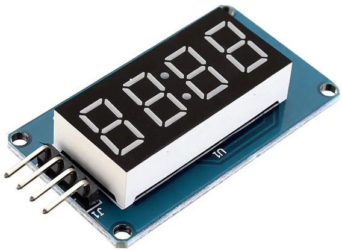 | TM1637 | 7-segment | 4-digit | <a href="https://green-possum-today.blogspot.com/2018/10/a-comparison-of-tm1637-protocol-with.html">Custom Serial (I2C variant)</a> | https://github.com/avishorp/TM1637 | https://www.banggood.com/custlink/GDD3zSq2qk |
| 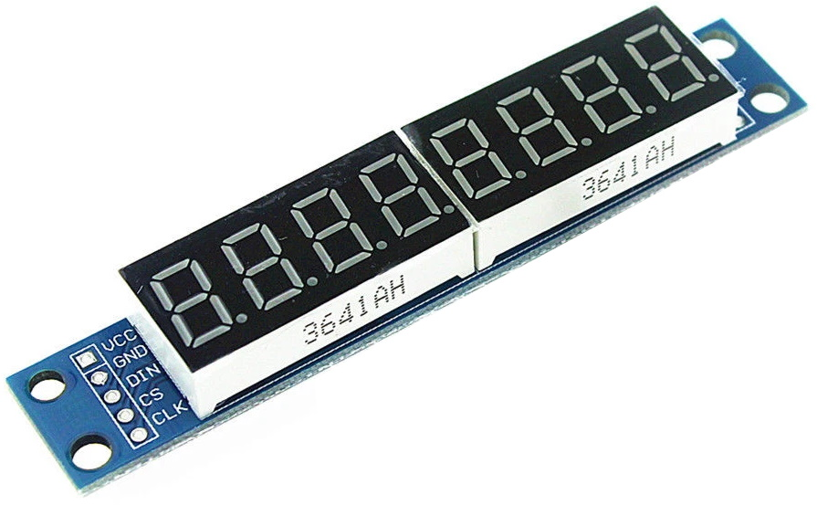 | MAX7219 | 7-segment  | 8-digit | SPI | https://github.com/wayoda/LedControl |  |
| 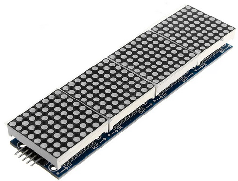 | MAX7219 | 8x8 | 8x8 | SPI | https://github.com/wayoda/LedControl / https://github.com/MajicDesigns/MD_Parola | https://www.banggood.com/custlink/GDvKsgCMKm |
| 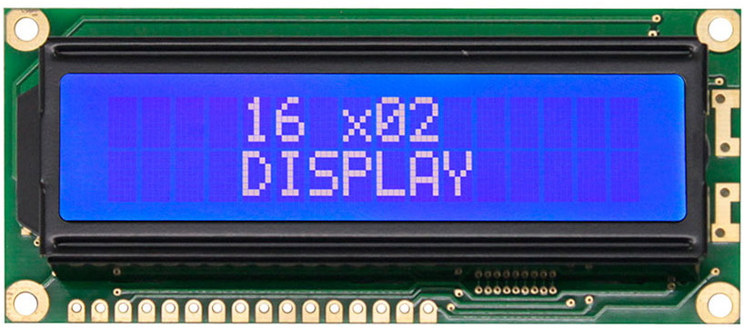 | HD44780 | LCD | 16x2 character (each char 5x8) | I2C (0x27 or 0x3F) | https://github.com/mathertel/LiquidCrystal_PCF8574 | https://www.banggood.com/custlink/vDKEsPbVKw |
| 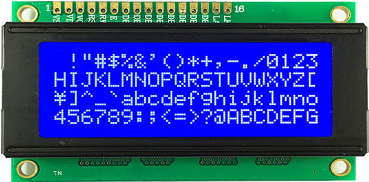 | HD44780 | LCD  | 20x4 character (each char 5x8) | I2C | https://github.com/duinoWitchery/hd44780 Note DO NOT use the PCF library above - it cannot handle setCursor on 4 line displays correctly | https://www.banggood.com/custlink/mG3EO6066Y |
| 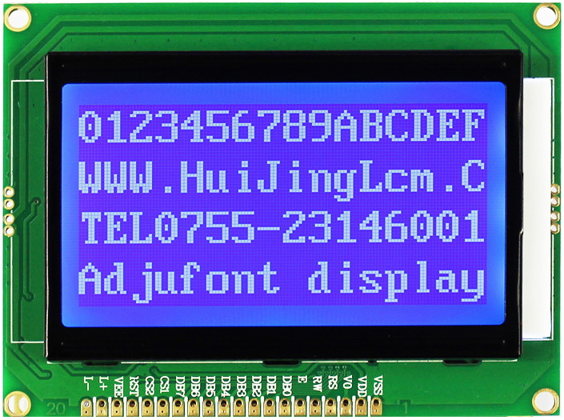 | [ST7920](#ST7920) (Identifiabale by pins labelled PSB/NC ) | LCD | 128x64 | SPI | https://github.com/olikraus/u8g2 (using constructor as U8G2_ST7920_128X64_1_HW_SPI u8g2(U8G2_R0, 10, 8); )| https://www.banggood.com/custlink/G3vY8zzr27 |
| 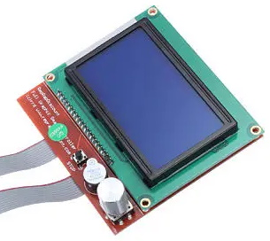 | [ST7920 "RepRap Discount")](#ST7920) | LCD | 128x64 | SPI | https://github.com/olikraus/u8g2 (using constructor as U8G2_ST7920_128X64_1_HW_SPI u8g2(U8G2_R0, 10, 8); )| https://www.banggood.com/custlink/K33E9qkcUv |
| 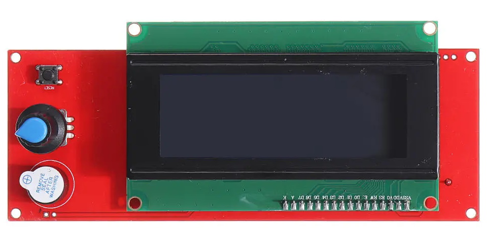 | [ST7920 "RepRap Discount Smart Controller")] | LCD | 20x4 character | SPI | LiquidCrystal | https://www.banggood.com/custlink/mGvd428bCG |
| 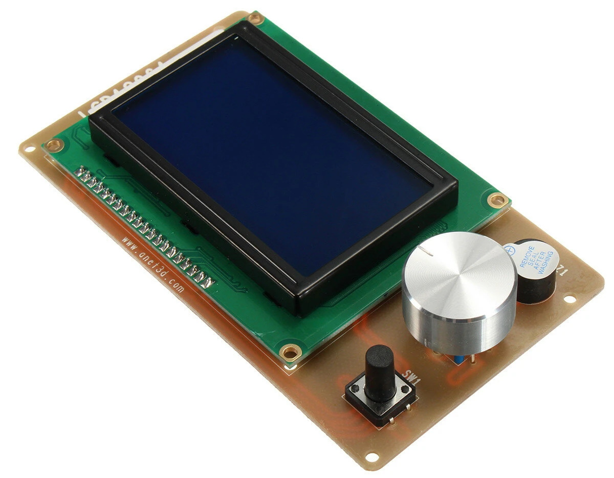 | [ST7920 ("ANet")](#ST7920) | LCD | 128x64 | SPI | https://github.com/olikraus/u8g2 (using constructor as U8G2_ST7920_128X64_1_HW_SPI u8g2(U8G2_R0, 10, 8); )| https://www.banggood.com/custlink/3KGYiMkCzy |
| 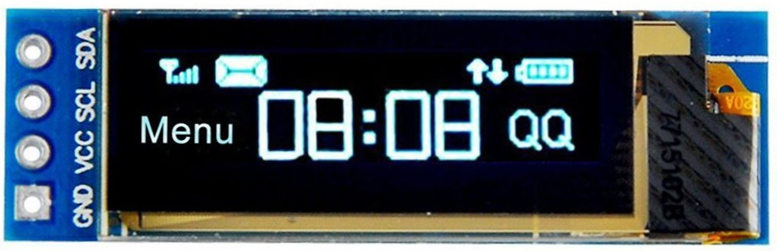 | SSD1306 | OLED | 128x32  | I2C | https://github.com/lexus2k/lcdgfx | https://www.banggood.com/custlink/v3KEAtAPYE |
| 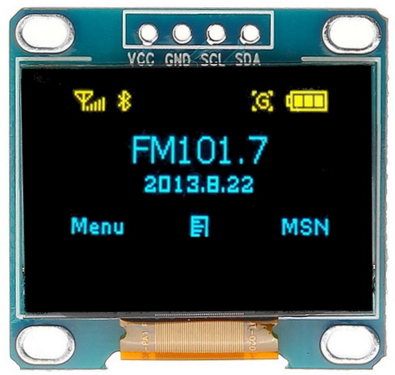 | SSD1306 | OLED | 128x64 | I2C | https://github.com/lexus2k/lcdgfx | https://www.banggood.com/custlink/GG3yNFn5Rp |
| 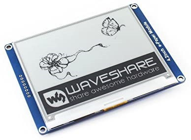 | e-Ink  | e-Ink | Variable | SPI | https://github.com/waveshare/e-Paper | https://www.banggood.com/custlink/33vdN5b5yj |
| 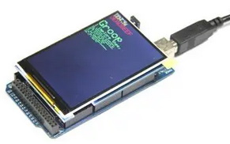 | ILI9486 | TFT | Variable | 8-bit parallel | https://github.com/prenticedavid/MCUFRIEND_kbv | https://www.banggood.com/custlink/mvGEn5n5ds |
| 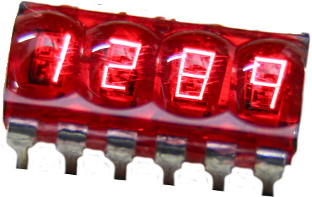 | HP5082-74xx | GaAsP | 7-segment | 8-bit strobed | https://github.com/wayoda/LedControl |  |
| 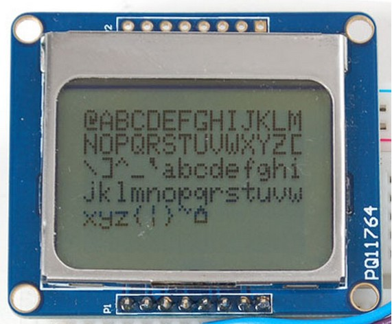 | PCD8544 | LCD | 84x48 | SPI | https://github.com/carlosefr/pcd8544 | https://www.aliexpress.com/item/32621869484.html |

https://github.com/carlosefr/pcd8544

# 7-Segment Displays
Here's a bunch of 7-segment displays from my parts drawer. It's *generally* possible to identify the size, colour, and CA/CC configuration from the model number, as shown below:

| Part Num | Size | Colour | Type | Link |
| -------------- | ------------- | ------------- | ------------- | ------------- |
| SH18101BS | 1.8" (46mm) | Red | Common Anode | https://www.yoycart.com/Product/572970879988/ |
| FJS15102BH | 1.5" (38.1mm) | Red | Common Anode | 4V, 20mA, https://www.thegioiic.com/fjs15102bh-led-7-doan-1-5inch-do-1-so-duong-chung |
| 5611BH | 0.56" (14mm) | Red | Common Anode | 1.8V, 30mA, http://www.xlitx.com/datasheet/5611BH.pdf |
| 5611AH | 0.56" (14mm) | Red | Common Cathode | 1.8V, 30mA, http://www.xlitx.com/datasheet/5611AH.pdf |
| KW1-562CYB | 0.56" (14mm) | Orange | Common Cathode | 2.4V, 20mA, http://datasheets.leedshackspace.org.uk/KW1-562CYB.txt |
| FEM-0561R340BGWT1 | 0.56" (14mm) | Red | Common Cathode | 1.8V, 20mA, https://uk.farnell.com/forge/fem-0561r340bgwt1/display-seven-segment-14mm-red/dp/2706011 |
| FEM-0561B200BGWT1 | 0.56" (14mm) | Blue | Common Cathode | 3.3v, 20mA, https://uk.farnell.com/forge/fem-0561b350bgwt1/display-seven-segment-14mm-blue/dp/2706017?st=fem-056 |
| FEM-0801W3SM0BGWT1 | 0.8" (20mm) | White | Common Cathode | 3.8V, 20mA, https://uk.farnell.com/forge/fem-0801w4sm0bgwt1/display-seven-segment-20mm-white/dp/2706010 |

Note that there are also several variations in pinout - check the datasheet!

 - For displays of 0.56" or smaller, it's preferable to use a Common Cathode configuration, and driven by a LED multiplexer chip: MAX7219 (SPI) or HT16K33 (I2C)
 - For displays larger than that, it's preferable to use a Common Anode configuration, with an individual TPIC6B595 per digit to sink the segments.

# ST7920
ST7920 is a popular controller chip used to 128x64 LCD panels. In its simplest form, it can be controlled via either parallel or serial (SPI) interface (selectable via the PSB/NC pin). Since the board sends no data back to the controller, there is no MISO pin to connect for the SPI interface - just MOSI, CLK, and SS, along with 5V and GND for the display controller and also the backlight, and an optional reset pin.

It also comes packaged on various controller boards designed for 3D printers, which are convenient because they also have a rotary or joystick input, a button, and a buzzer on the same board. However, these are often badly-documented, and all have a slightly different pinouts. Two common varieties I've found are:

## Rep Rap Discount
 

## ANet

## Rep Rap Discount Smart Controller
 

