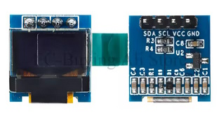
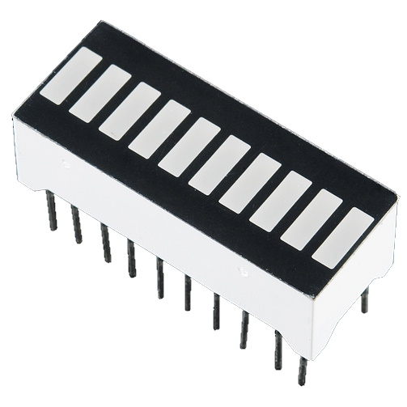
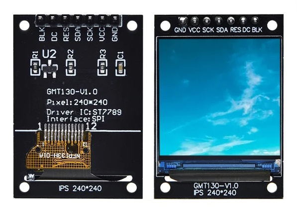

# arduino-displays
Libaries, wiring, and example code for various small displays used with Arduino and other microprocessors


| Image | Chipset  | Voltage | Type | Resolution  | Interface | Code  | Purchase |
| -------------- | ------------- | ------------- | ------------- | ------------- | ------------- | ------------- | ------------- |
|  | TM1637 | 3.3V / 5V | 7-segment | 4-digit | <a href="https://green-possum-today.blogspot.com/2018/10/a-comparison-of-tm1637-protocol-with.html">Custom Serial (I2C variant)</a> | https://github.com/RobTillaart/TM1637_RT | https://www.banggood.com/custlink/GDD3zSq2qk |
|  | MAX7219 | 5V | 7-segment  | 8-digit | Serial (similar to, but not quite SPI!) | https://github.com/wayoda/LedControl |  |
|  | MAX7219 | 5V | 8x8 | 8x8 | Serial (but note: cannot share an SPI interface!) | https://github.com/MajicDesigns/MD_MAX72XX (can be extended with https://github.com/MajicDesigns/MD_Parola ) | https://www.banggood.com/custlink/GDvKsgCMKm |
|  | PCF8574 | 5V | LCD | 16x2 character (each char 5x8) | I2C backpack (PCF8574A is 0x3F, PCF8574 is 0x27) | https://github.com/mathertel/LiquidCrystal_PCF8574 | https://www.banggood.com/custlink/vDKEsPbVKw |
|  | HD44780 | 5V | LCD  | 20x4 character (each char 5x8) | I2C backpack | https://github.com/duinoWitchery/hd44780 Note DO NOT use the PCF library above - it cannot handle setCursor on 4 line displays correctly | https://www.banggood.com/custlink/mG3EO6066Y |
|  | "RepRap Discount Smart Controller" | 5V | LCD | 20x4 character | I2C backpack | LiquidCrystal | https://www.banggood.com/custlink/mGvd428bCG |
|  | [ST7920](#ST7920) (Identifiable by pins labelled PSB/NC ) | 3.3V/5V | LCD | 128x64 | 8-bit paraller/4-bit parallel/SPI (but cannot share interface! See https://forum.arduino.cc/t/u8glib2-issues-with-st7920-128-64-with-arduino-mega/691999/8 | https://github.com/olikraus/u8g2 (using constructor as U8G2_ST7920_128X64_F_SW_SPI u8g2(U8G2_R0, /* clock=*/ 13, /* data=*/ 11, /* CS=*/ 10, /* reset=*/ 8); )| https://www.banggood.com/custlink/G3vY8zzr27 |
|  | "RepRap Discount" ST7920 | 5V | LCD | 128x64 | 4-bit parallel (or use I2C backpack) | https://github.com/olikraus/u8g2 (using constructor as U8G2_ST7920_128X64_1_HW_SPI u8g2(U8G2_R0, 10, 8); )| https://www.banggood.com/custlink/K33E9qkcUv |
|  | ANet ST7920 | 5V | LCD | 128x64 | 4-bit parallel (or use I2C backpack) | https://github.com/olikraus/u8g2 (using constructor as U8G2_ST7920_128X64_1_HW_SPI u8g2(U8G2_R0, 10, 8); )| https://www.banggood.com/custlink/3KGYiMkCzy |
|  | SSD1306 | 3.3V | OLED | 128x64 | I2C | https://github.com/lexus2k/lcdgfx | https://www.banggood.com/custlink/GG3yNFn5Rp |
|  | SSD1306 | 3.3V | OLED | 128x32  | I2C | https://github.com/lexus2k/lcdgfx | https://www.banggood.com/custlink/v3KEAtAPYE |
|   | 0.49" SSD1306 | 3.3V | OLED | 64x32 | I2C | https://github.com/olikraus/u8g2 (using U8G2_SSD1306_64X32_1F_F_HW_I2C u8g2(U8G2_R0, /* reset=*/ U8X8_PIN_NONE);  constructor) | https://www.aliexpress.com/item/1005003874700775.html |
|  | e-Ink  | 3.3V | e-Ink | Variable | SPI | https://github.com/ZinggJM/GxEPD2 or https://github.com/waveshare/e-Paper | https://www.banggood.com/custlink/33vdN5b5yj |
|  | ILI9486 | TFT | Variable | 8-bit parallel | https://github.com/prenticedavid/MCUFRIEND_kbv | https://www.banggood.com/custlink/mvGEn5n5ds |
|  | HP5082-74xx  | ? | GaAsP | 7-segment | 8-bit strobed | https://github.com/wayoda/LedControl |  |
|  | PCD8544 | 3.3V | LCD | 84x48 | SPI | https://github.com/carlosefr/pcd8544 or https://github.com/olikraus/u8g2 (using constructor U8G2_PCD8544_84X48_F_4W_SW_SPI u8g2(U8G2_R0, /* clock=*/ 25, /* data=*/ 26, /* cs=*/ 12, /* dc=*/ 27, /* reset=*/ 14);  // Nokia 5110 Display)| https://www.aliexpress.com/item/32621869484.html |
|  | LED Bargraph | ?V | LED | N/A | N/A | N/A | https://www.sparkfun.com/products/9935 |
|   | 1.3" ST7789 | 3.3/5V | TFT | 240x240 | SPI | https://github.com/Bodmer/TFT_eSPI | https://www.aliexpress.com/item/1005006532468602.html |


# MAX7219 Matrix
LedControl library _might_ work, but only on certain hardware configurations. MD_MAX72xx is more flexible. Most cheap eBay boards etc. require MD_MAX72XX::FC16_HW.
Also note that data input is on the right hand side!

# 7-Segment Displays
Here's a bunch of 7-segment displays from my parts drawer. It's *generally* possible to identify the size, colour, and CA/CC configuration from the model number, as shown below:

| Part Num | Size | Colour | Type | Link |
| -------------- | ------------- | ------------- | ------------- | ------------- |
| SH18101BS | 1.8" (46mm) | Red | Common Anode | https://www.yoycart.com/Product/572970879988/ |
| FJS15102BH | 1.5" (38.1mm) | Red | Common Anode | 4V, 20mA, https://www.thegioiic.com/fjs15102bh-led-7-doan-1-5inch-do-1-so-duong-chung |
| 5611BH | 0.56" (14mm) | Red | Common Anode | 1.8V, 30mA, http://www.xlitx.com/datasheet/5611BH.pdf |
| 5611AH | 0.56" (14mm) | Red | Common Cathode | 1.8V, 30mA, http://www.xlitx.com/datasheet/5611AH.pdf |
| KW1-562CYB | 0.56" (14mm) | Orange | Common Cathode | 2.4V, 20mA, http://datasheets.leedshackspace.org.uk/KW1-562CYB.txt |
| FEM-0561R340BGWT1 | 0.56" (14mm) | Red | Common Cathode | 1.8V, 20mA, https://uk.farnell.com/forge/fem-0561r340bgwt1/display-seven-segment-14mm-red/dp/2706011 |
| FEM-0561B200BGWT1 | 0.56" (14mm) | Blue | Common Cathode | 3.3v, 20mA, https://uk.farnell.com/forge/fem-0561b350bgwt1/display-seven-segment-14mm-blue/dp/2706017?st=fem-056 |
| FEM-0801W3SM0BGWT1 | 0.8" (20mm) | White | Common Cathode | 3.8V, 20mA, https://uk.farnell.com/forge/fem-0801w4sm0bgwt1/display-seven-segment-20mm-white/dp/2706010 |
| FN1-1002R3400 | 1.0" (25mm) | Red | Common Anode | 

Note that there are also several variations in pinout - check the datasheet!

 - For smaller, lower voltage displays (typically 0.56" or smaller), it's preferable to use a Common Cathode configuration, and driven by a LED multiplexer chip: MAX7219 (SPI) or HT16K33 (I2C). Note that these cannot supply enough power for larger displays, that typically have multiple LEDs per segment. For those, you can use a UDN2981 on the high side and ULN2803 on the low side. 
 - For displays larger than that, it's preferable to use a Common Anode configuration, and an individual TPIC6B595 per digit to sink the segments. This is *not* multiplexed, so can provide constant 5V.


# 10-Segment Bargraph Displays
These are really nothing more than 10 coloured LEDs stacked on top of each other - no driver circuitry, and no resistors. 
 - They can be driven direct from GPIO pins (with appropriate resistor - they're only tiny LEDs, with 20mA If, so probably 330Ω - 1kΩ each). 
 - Alternatively, you could use a shift register like a 74HC595 (though that can only sink 6mA, and only had 8 channels). 
 - Or, a LM3914 analog driver, which determines which segments to light from an analog input (take a PWM output from a GPIO pin and then smooth it through an RC circuit to feed the signal line input as described in https://forum.arduino.cc/t/low-pass-filter-for-pulse-width-modulation/498556).
 - Or, a multiplexing LED driver like a MAX7219 (64 LEDs via SPI) or HT16K33 (128 LEDs via I2C). These are somewhat overkill to only light 10 LEDs, but otherwise are perfectly designed for the job!
 
The only last remaining problem is to get the correct polarity for the bar graph displays themselves. Here are how some of my bargraphs are labelled:
 - 2510SR-1 (Red), _anodes_ are on the labelled side
 - B10R (Red), _anodes_ are on the labelled side
 - B10B (Blue),  _anodes_ are on the labelled side 
 - B10Y (Orange), _anodes_ are on the labelled side
 - 1025G (Green), _cathodes_ are on the labelled side!
 - HSN-2510BG (Green), _anodes_ are on the labelled side

# Graphic Displays (e.g. 128x64)
The Sitronix ST7920 chip is a popular controller chip used to 128x64 LCD panels. It can be controlled via either parallel or serial (SPI) interface (selectable via the PSB/NC pin), but serial is significantly easier to implement! Since the board sends no data back to the controller, there is no need for a MISO pin to connect for the SPI interface - just MOSI, CLK, and SS, along with 5V and GND for the display controller and also the backlight, and an optional reset pin.

DO NOT be tempted to buy an "I2C convertor", such as this: https://www.aliexpress.com/item/1005006695581586.html
That board uses an MCP23017 GPIO expander to address the pins of the LCD in 8-bit parallel mode (which is in theory faster). But, seeing as the MCP23017 must be controlled via I2C at 400kHz, this ends up being slower and more complicated than if you'd just used the LCD in SPI mode! 

You can't share ST7920 with other SPI devices on the HW SPI bus, so you may as well use software serial SW SPI (bit-banging) (See https://forum.arduino.cc/t/u8glib2-issues-with-st7920-128-64-with-arduino-mega/691999/3)

Use u8g2 library, together with any 3 available GPIO pins, with the following constructor:

```U8G2_ST7920_128X64_F_SW_SPI u8g2(U8G2_R0, /* E=*/ 13, /* R/W=*/ 11, /* RS=*/ 10, /* reset=*/ -1);```

According to the <a href="https://www.waveshare.com/datasheet/LCD_en_PDF/ST7920.pdf>datasheet</a> (see table p33/42), the ST7920 requires a HIGH signal to be 0.7*VDD. 
Empirically, the ST7920 chip itself will operate at 3.3V logic, BUT the crystals require at least 4.5V on Vdd to activate. However, the SPI lines can be run from an ESP32 or other 3.3V microprocessor just fine without the need for any level conversion.


It also comes packaged on various controller boards designed for 3D printers, which are convenient because they also have a rotary or joystick input, a button, and a buzzer on the same board. However, these are often badly-documented, and all have a slightly different pinouts. Two common varieties I've found are:

## Rep Rap Discount "Full Graphic" Controller
 

## ANet


# Character Displays
Unlike the "full graphic" 128x64 pixel displays, these displays have fixed character blocks, typically either 2 rows of 16 characters (1602) or 4 rows of 20 characters (2004).
In their "raw" form, they typically use a Hitachi HD44780 controller which has a 16-pin single-line connector situated above the display, however, not all of those pins need to be connected, depending on the mode used.

### 8-bit Parallel Mode
This is the fastest mode (in terms of _data transfer_ rate, at least), and also the most robust. 
The disadvantage is that it requires 8 data lines to be connected, allowing all 8 bits of a single byte character to be read on one pass.  (representing the 8 bits of each character sent). Also, in practice, there is little speed advantage over the 4-bit parallel mode, since the limiting factor is the refresh rate of the LCD screen rather than the rate at which data is transferred anyway.  

 - Yes, you could use a shift register (i.e. a pair of 74HC595's) to control all 8 data pins, but then you're defeating the benefit of parallelism, since you have to load the shift registers serially one bit at a time (SIPO, remember..) 
 - You could also use a port expander (e.g. a MCP23S17), but then you are limited by the speed of the interface to the chip (i.e. you I2C or SPI bus speed), and also have to send additional bytes of information to set the control registers for the chips together with each item of data sent, which outweighs any performance gain.

So, basically, there is never any reason to use 8-bit mode.

### 4-bit Parallel Mode
This is the mode you will almost always see used. It requires 4 data pins and 3 (or, generally, only 2) control pins, as follows:

| Label | Function |
|--- |--- |
| VSS | GND |
| VDD | 5V <sup>*</sup> |
| VO | Voltage offset for contrast adjustment. Varies from GND to VCC. |
| RS | Register Select. When RS is LOW, data is treated as a command; when RS is HIGH, data is treated as character data. |
| RW | Read/Write. When LOW data, data is sent to the board; when HIGH, data is read from the board. Can generally be tied to GND. |
| E | Enable. Pulsed from LOW to HIGH to initiate data transfer. |
| D0 | - |
| D1 | - |
| D2 | - |
| D3 | - |
| D4 | Data4 |
| D5 | Data5 |
| D6 | Data6 |
| D7 | Data7 |
| A | Backlight Anode (+ve) |
| K | Backlight Cathode (-ve) |

<sup>*</sup>  Although the specifications for the HD44780 states that the IC can run as low as 2.7V, it is the output of the HD44780 IC to the LCD panel that becomes the problem. This is where low or no contrast becomes an issue at 3.3V.

Data pins D0-D3 are not connected. Instead, a single byte of data is shifted in two 4-bit nibbles, re-using the D4-D7 pins each time.

The display can be controlled using the LiquidCrystal library, with the constructor specifying the GPIO pins connected to those pins, as follows:
LiquidCrystal lcd(rs, en, d4, d5, d6, d7);

### Nokia LCD
The Nokia 5110 LCD is an 84x48 LCD using the PCD8544 controller chip. It requires 3.3V logic, and can be wired to an ESP32 using a minimum of 4 wires - SCK, CE, DIN, and DC. To enable hardware reset, also requires RST, and for backlight dimming, BL, but these can optionally be tied to a 3.3V source (via 10k and 220ohm resistors, respectively) if they don't need to be separately controlled.


### I2C Backpack
One very common modification to these displays is the addition of a PCF8574 I2C port expander, which allows the LCD to be address via only two I2C pins - SDA and SCK, together with 5V and GND.
Commands sent to the PCF8574 set the state of its 8 GPIO pins, typically wired as follows to the LCD (see https://github.com/mathertel/LiquidCrystal_PCF8574/blob/master/src/LiquidCrystal_PCF8574.cpp):

| PCF8574 | HD44780 |
| --- | --- |
| P0 | RS |
| P1 | - |
| P2 | E |
| P3 | - |
| P4 | D4 |
| P5 | D5 |
| P6 | D6 |
| P7 | D7 |

## Rep Rap Discount Smart Controller
See schematic at https://reprap.org/mediawiki/images/7/70/Controller_final_reprapdiscount.pdf


This combines the "raw" 2004 LCD display with a buzzer and rotary switch. It also has a particularly poorly-documented pinout.

The RW of the LCD display is tied to GND.


PCF8574 controllers


